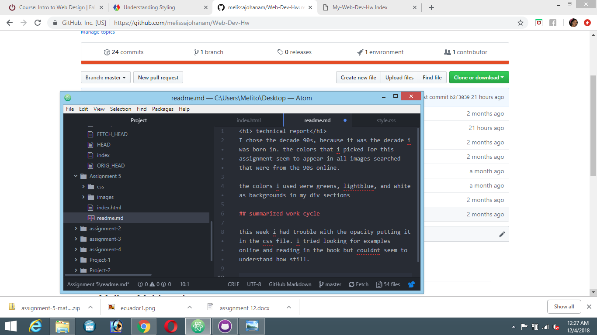

<h1> technical report</h1>
I chose the decade 90s, because it was the decade i was born in. the colors that i picked for this assignment seem to appear in all images searched that were from the 90s online.

the colors i used were greens, lightblue, and white as backgrounds in my div sections

## summarized work cycle

this week i had trouble with the opacity putting it in the css file. i tried looking for examples online and reading in the book but couldnt seem to understand how still.

## screenshot of workflow

