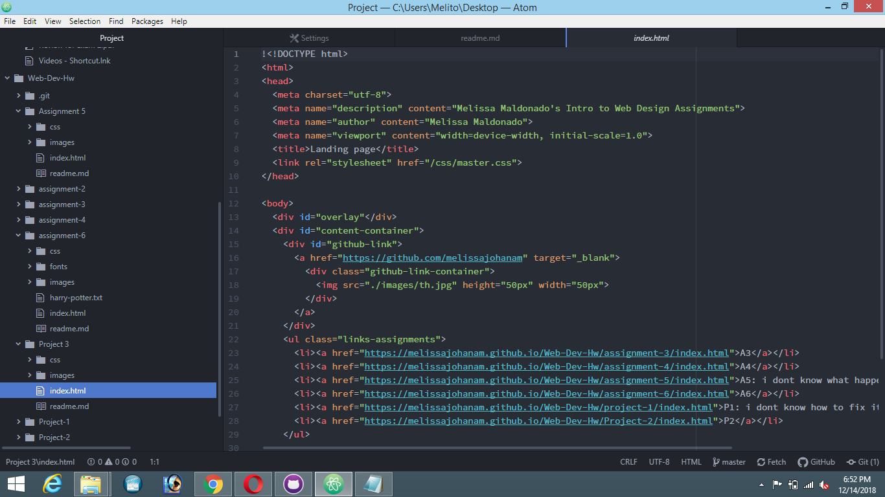

<h1> landing page</h1>

<h2> What's the difference between padding, margin, and borders?</h2>

 padding is the amount of space between the inner content of the element itself. Margin is the space between the box and element and other elements, or the edge of the parent element. Finally, border surrounds an element, and is used to define edges of the element.

<h3> What was the hardest task for you to accomplish this assignment? for example, was it overlapping elements, working with sizing, creating layout, or something else entirely?

 the hardest task for  me to accomplish was finding the idea of how i want it to look so i just went for the basic look. hoping that i did the overlapping elements right.

# summarize your work cycle#

For this last assignment, like i said above i just went for the basic. I didn't really want to complicate things in the process.

I really enjoyed seeing how all my assignments turned out to be in one whole final assignment. I am very proud of myself to be able to stay caught up in all assignments while I am taking care of my 2 month old son. I thought I wouldn't be able to accomplish many of the assignments.

<h3>I really liked this class.</h3>

