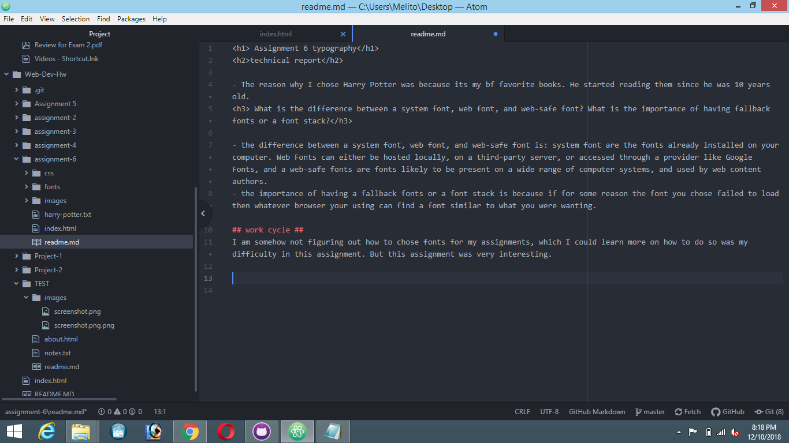

<h1> Assignment 6 typography</h1>
<h2>technical report</h2>

- The reason why I chose Harry Potter was because its my bf favorite books. He started reading them since he was 10 years old.
<h3> What is the difference between a system font, web font, and web-safe font? What is the importance of having fallback fonts or a font stack?</h3>

- the difference between a system font, web font, and web-safe font is: system font are the fonts already installed on your computer. Web Fonts can either be hosted locally, on a third-party server, or accessed through a provider like Google Fonts, and a web-safe fonts are fonts likely to be present on a wide range of computer systems, and used by web content authors.
- the importance of having a fallback fonts or a font stack is because if for some reason the font you chose failed to load then whatever browser your using can find a font similar to what you were wanting.

## work cycle ##
I am somehow not figuring out how to chose fonts for my assignments, which I could learn more on how to do so was my difficulty in this assignment. But this assignment was very interesting.

